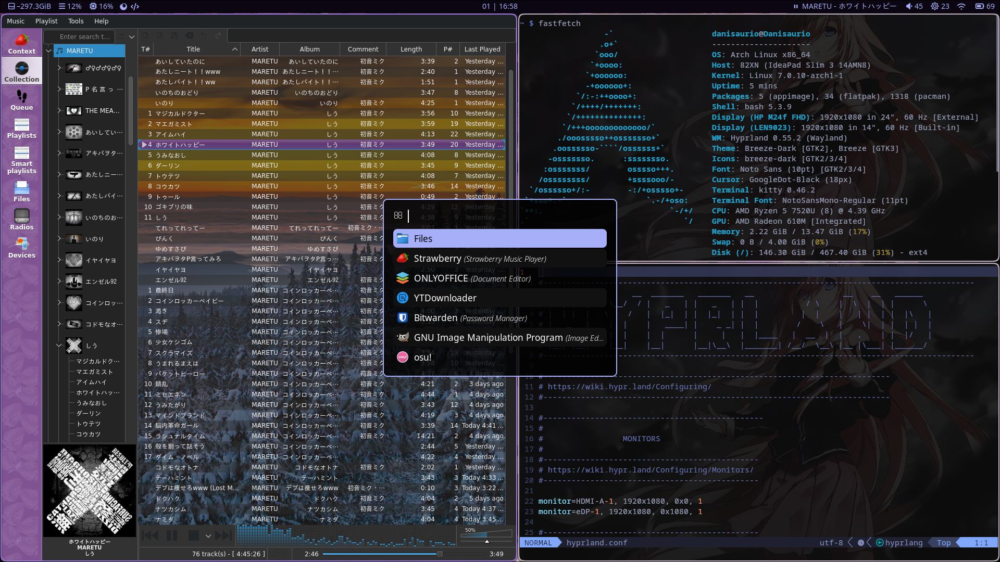

These are my hyprland configuration files

move hypr, rofi, waybar and dunst directories to .config (ignore the images directory)  
place wallpaper images in ~/Pictures  
Requires hyprland, hyprpaper, hyprlock, hyprsunset,  waybar, rofi and dunst to be installed  
Follow the documentation linked in each configuration file to edit them
